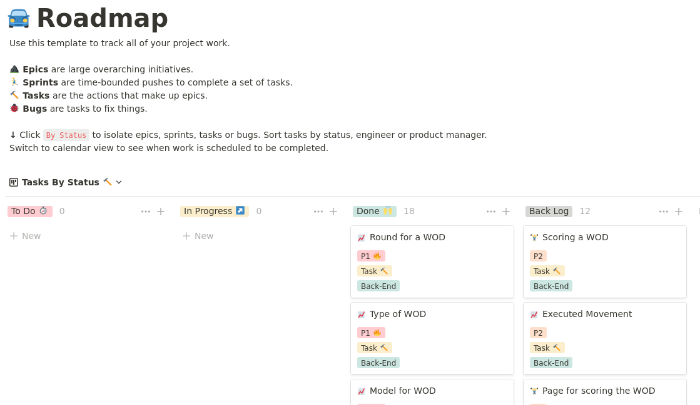
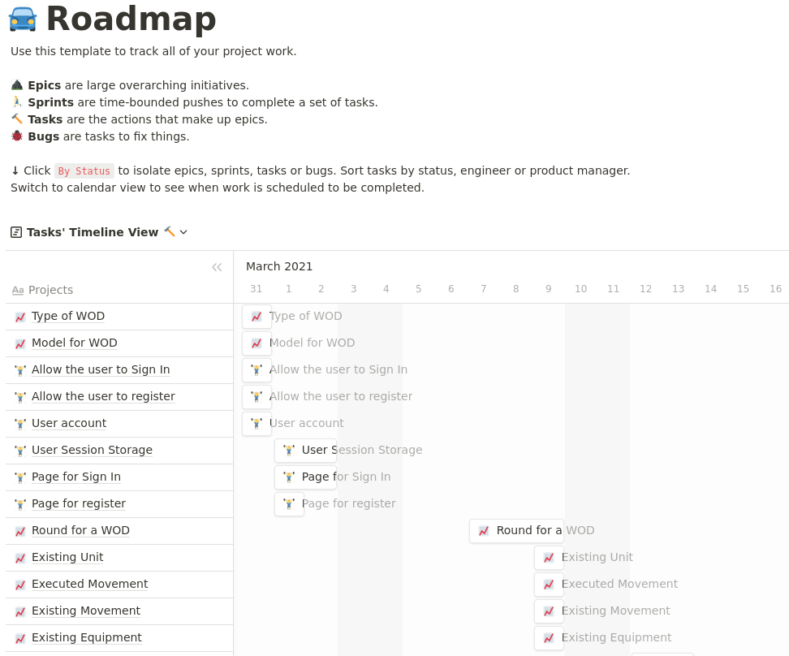

---
title: "Projet 13 - Projet final : prêt pour le feu d’artifices ?"
subtitle: "Parcours OpenClassrooms - Développeur d'application Python"
author:
  - "Étudiant : Guillaume OJARDIAS"
  - "Mentor : Erwan KERIBIN"
  - "Mentor évaluateur : Jimmy Kuassi KUMAKO"
geometry: margin=2cm
...

\pagebreak

\renewcommand{\contentsname}{Sommaire}
\tableofcontents

\pagebreak

# I. Présentation

## I.1. Liens du projets

- Le code source du projet est disponible sur la plate-forme GitHub à cette adresse : _[https://github.com/GuillaumeOj/P13-WOD-Board](https://github.com/GuillaumeOj/P13-WOD-Board)_.
- Le site est visible en ligne à cette adresse : _[http://projet-13.ojardias.io/](http://projet-13.ojardias.io/)_.
- La roadmap est accessible ici : _[https://www.notion.so/guillaumeoj/](https://www.notion.so/guillaumeoj/8c4537ce16a44754b703d0885754ec1f?v=45b8fc5944684d30a5fac8a3488f6547)_.

## I.2. Contexte du projet

Il s'agit du projet final de la formation développeur d'application Python, proposé par OpenClassrooms.
Le but de cette application est de permettre aux pratiquants du Crossfit®️ de tenir un journal de bord de leurs séances.
La note d'intention (voir _P13_01_Note_intention_) détail les objectifs de ce projet.

## I.3 Organisation du projet

Pour planifier et organiser le projet, une roadmap sous forme de Kanban à était réalisée.
La roadmap est disponible ici : _[https://www.notion.so/guillaumeoj/](https://www.notion.so/guillaumeoj/8c4537ce16a44754b703d0885754ec1f?v=45b8fc5944684d30a5fac8a3488f6547)_.
Elle se découpe en quatre colonnes:

1. To Do : tâches à réaliser;
2. In Progress : tâches en cours de réalisation;
3. Done : tâches terminées;
4. Backlog : tâches prévues.

Pour la planification, chaque tâche s'est vue attribuer une date de début et de fin.
Ces dates ont permis d'estimer le temps nécessaire à la réalisation d'un Minimum Viable Product.

# II. Démarche de création

## II.1 Stack technique

L'application est divisée en deux parties distinctes : back-end et front-end.

La partie back-end repose sur l'utilisation du framework FastAPI (_[https://fastapi.tiangolo.com/](https://fastapi.tiangolo.com/)_).
La base de données est gérée avec PostgreSQL (_[https://www.postgresql.org/](https://www.postgresql.org/)_).
L'interface avec le langage Python se fait grâce à l'ORM SQLAlchemy (_[https://www.sqlalchemy.org/](https://www.sqlalchemy.org/)_).

La partie front-end est une application ReactJS (_[https://reactjs.org/](https://reactjs.org/)_).
Cette application utilise l'API créée grâce à FastAPI pour communiquer avec le back-end.

Ce choix va à l'encontre des technologies rencontrées lors de notre parcours de formation.
Il s'agissait de profiter de la formation pour découvrir ces frameworks avant l'entrée sur le monde du travail.

\pagebreak

## II.2. Modèle de données

L'application minimale contient 6 grandes classes :

1. **User** : pour les informations relatives à l'utilisateur de l'application;
2. **Wod** : correspond à un exercice (Workout Of the Day);
3. **Round** : est un tour dans un Wod, un Wod peut être composé de un ou plusieurs tours;
4. **Movement** : décrit un mouvement de base en Crossfit®️ (pompe, traction, etc.);
5. **Goal** : détaille un Movement avec un nombre de répétition et ou un temps imposé pour sa réalisation;
6. **Equipment** : liste les équipements utilisable au Crossfit®️ (dumbbell, barre de traction, etc.).

Les 2 autres classes sont les suivantes :

1. **WodType** : définit la catégorie de Wod, nécessaire au calcul du score final;
2. **UnitType** : est une classe générique pour lister les unités de mesures (mètres, kilogrammes, etc.).

## II.3. Tests de l'application

Les tests sont réalisé sur la partie back-end de l'application.
Les tests back-end couvrent 98% du code. Un accent particulier à était mis sur deux points importants :

- les routeurs de l'API (points d'entrée);
- les fonctions de CRUD (Create Read Update Delete).

Ces tests ont étaient réalisé dans l'esprit du TDD.
Ils sont disponibles ici : _[https://github.com/GuillaumeOj/P13-WOD-Board/tree/main/backend/wod_board/tests](https://github.com/GuillaumeOj/P13-WOD-Board/tree/main/backend/wod_board/tests)_

Les tests de l'application front-end ont été mis de côté, par manque de temps et de connaissance du framework de test de ReactJS.

# III. Bilan

## III.1. Prise en main de la stack technique

### a. Front-end

{ width=80px }

Le front-end est un point que je souhaite retravailler fortement par la suite.
Mon plus grand regret est de ne pas avoir mener le développement de l'application en TDD.
En effet le débugage du front-end est complexe sans ces tests, et l'application en comporte un nombre significatifs :

- système de messages;
- gestion des erreurs;
- gestion de l'authentification;
- etc.

Pour la suite, je souhaite améliorer mes connaissances de ReactJS et revoir complètement le découpage du front-end.

### b. Back-end

{ width=250px }

La mise en place du back-end à était plus complexe que je ne l'avais imaginé au début du projet.
Le fait d'avoir utilisé SQLAlchemy lors de mon stage en entreprise, m'a aidé pour son utilisation.
En revanche, la mise en place d'un outil demande des connaissances particulières que j'ai du apprendre et mettre en pratique :

- configuration de SQLAlchemy et Alembic;
- lien entre FastAPI et SQLAlchemy;

{ width=80px }

Pour ce qui est de FastAPI, la courbe d'apprentissage à était assez rapide.
Mon expérience de l'utilisation du type hinting à était un vrai plus pour la compréhension de Pydantic et donc du système de données avec FastAPI.
Le principal problème que j'ai rencontré : la gestion des utilisateurs. Django nous a habitué à une gestion native des comptes utilisateurs. Dans le cas de FastAPI, le développeur doit créer de toute pièce ce système. L'occasion pour moi de découvrir les bases de la création et de l'utilisation de token d'authentification.
Autre point que je souhaite absolument résoudre, l'utilisation de HTTPS. Lorsque l'application front-end communique avec le back-end tout se passe bien. En revanche la réponse de ce dernier cause une erreur CORS que je n'ai pas réussi à résoudre pour le moment. M'obligeant à supprimer le certificat dans les réglages de mon serveur.
De manière générale, ce framework est une véritable bonne découverte. J'ai hâte de continuer à utiliser cet outil.

## III.2. Planification du projet

{ width=300px }

Pour la planification de ce projet, je me suis aidé de Notion. Par défaut, l'application propose un template de roadmap bien taillé. Il permet de créer des cartes sous forme de Kanban.

{ width=300px }

Ces cartes peuvent être complétées par une date de début et de fin estimé. De cette façon on peut avoir une vue globale des tâches et de la chronologie du projet.

Les difficultés que j'ai rencontré au cours du projet sont les suivantes :

- oublie de mise à jour du statuts des tâches;
- aucune mise à jour de la chronologie lors de dérapage;

Cette organisation demande une discipline de fer pour en tirer le meilleur partie. Point sur lequel je dois encore m'améliorer.

## III.3. Choix des fonctionnalités
